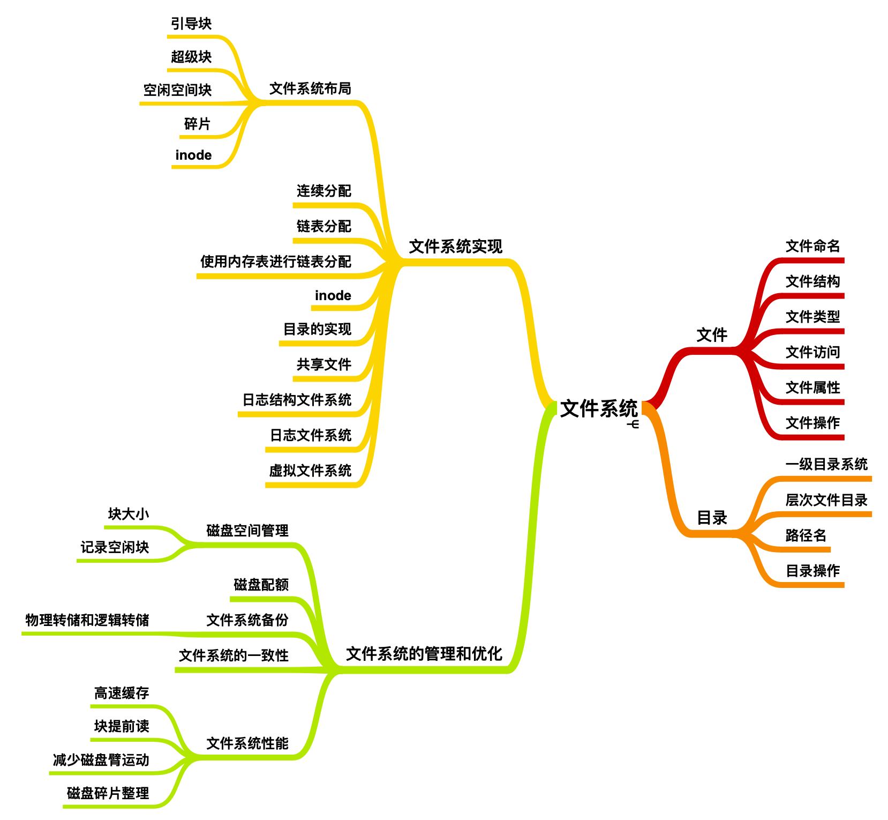
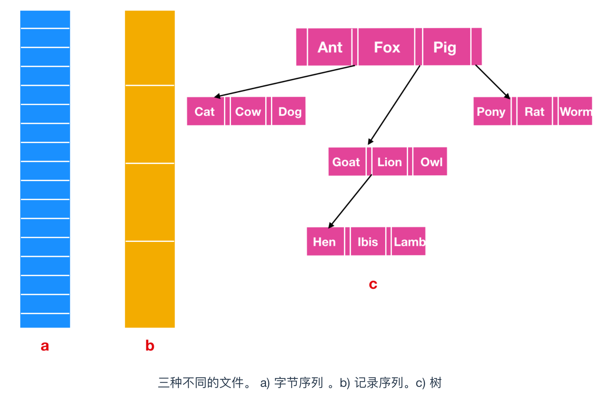

# file_system

1. 有结构文件（文本文件）：

    - 文本文件主要包含可读的字符数据，如字母、数字和符号等，这些字符通常遵循某种编码标准（如ASCII、UTF-8等）。
    - 文本文件可以用文本编辑器打开，内容对人类是直接可读的。
    - 文本文件中的数据通常有一定的结构，比如CSV（逗号分隔值）文件，每行代表一个数据记录，不同的字段之间用逗号分隔。
2. 无结构文件（二进制文件）：

    - 二进制文件包含的是编码后的数据，这些数据不仅限于文本，还可以是图像、视频、程序代码等。
    - 二进制文件不是为了直接被人阅读的，而是为了被计算机程序读取和处理。
    - 二进制文件的内容通常不遵循人类可读的编码标准，而是根据特定应用的需要以特定格式存储数据。

这两种文件类型的主要区别在于它们的内容和用途。文本文件因其简单和可读性，通常用于存储配置信息、代码、文档等。而二进制文件由于其高效的存储方式，适用于存储执行程序、数据库系统文件、多媒体文件等。

1. Text, Document, Demo:

    - has structure:
        - .txt
        - .md
        - .html
        - .latex
    - no structure:
        - .doc
        - .docx
        - .pdf
        - .pptx

2. code, script:

    - has structure:
        - .c
        - .cpp
        - .py
        - .js
        - .css
        - .html
        - .sh
        - .bat
        - .ps1
    - no structure:
        - .exe
        - .dll
        - .so

3. data:

    - has structure:
        - .csv
        - .json(JavaScript Object Notation):
        轻量级的数据交换格式, 易于人阅读和编写, 也易于机器解析和生成。
        - .yaml(YAML Ain't Markup Language): 更注重易读性, 使用缩进表示层级关系，无需额外的标记符号，如括号。通常用于配置(环境部署)文件和数据交换
        - .xml
    - no structure:
        - .db: 数据库文件
        - .xls: Excel文件
